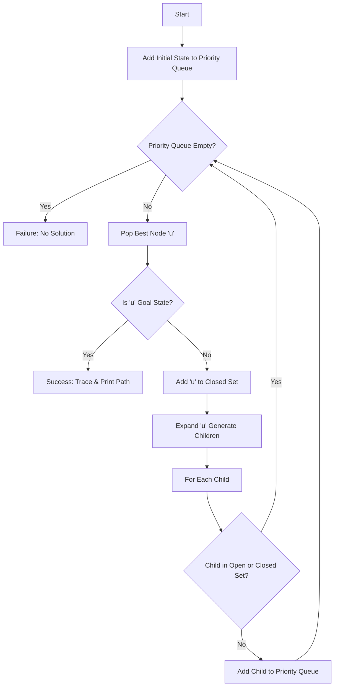

# A* 8-Puzzle Solver


A pure Python implementation of the **A* (A-Star) search algorithm** to solve the classic 8-puzzle sliding tile game. This project demonstrates the application of heuristic search strategies to find the optimal solution path from a scrambled state to a target configuration.

## 🏗️ Architecture

The solver uses a standard A* architecture with a Priority Queue (Open Set) and a Visited List (Closed Set).



## 🚀 Features

- **A* Search Algorithm**: Finds the shortest path to the solution.
- **Heuristic Evaluation**: Uses Hamming distance (misplaced tiles) + Depth cost to prioritize exploration.
- **Custom Data Structures**: Implements custom Priority Queue and Node classes without external dependencies.
- **Step-by-Step Solution**: Visualizes the board state at each step of the solution path.
- **Cycle Detection**: Prevents infinite loops by tracking visited states.

## 🛠️ Installation

1.  **Clone the repository**:
    ```bash
    git clone https://github.com/yourusername/a-star-8puzzle.git
    cd a-star-8puzzle
    ```

2.  **Ensure Python 3 is installed**:
    ```bash
    python --version
    ```

## 💻 Usage

Run the main script to solve the hardcoded puzzle instance:

```bash
python 8PuzzleA_Star.py
```

### Customizing the Puzzle
To solve a different puzzle, open `8PuzzleA_Star.py` and modify the `init` (Initial State) and `Term` (Terminal/Goal State) lists:

```python
# 0 represents the empty space ("_")
init = ["1", "_", "2",
        "7", "5", "4",
        "8", "6", "3"]
```

## 🤝 Contributing

Contributions are welcome! Please feel free to submit a Pull Request.

1.  Fork the project
2.  Create your feature branch (`git checkout -b feature/AmazingFeature`)
3.  Commit your changes (`git commit -m 'Add some AmazingFeature'`)
4.  Push to the branch (`git push origin feature/AmazingFeature`)
5.  Open a Pull Request

## 📄 License

This project is released under the **Unlicense**. See the [LICENSE](LICENSE) file for details.
